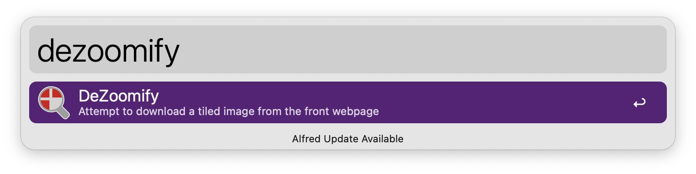
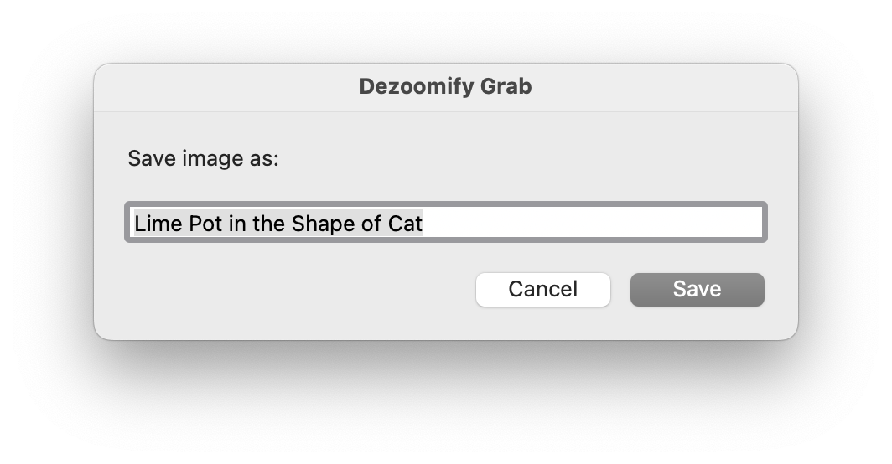
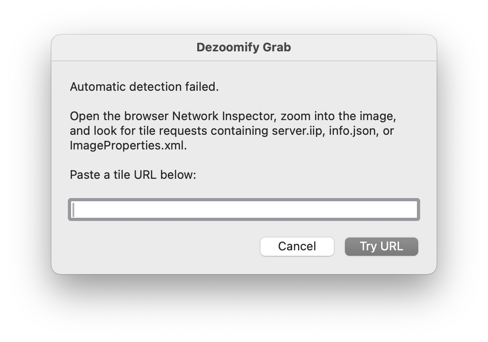

# md-alfred-dezoomify — v1.2

Alfred workflow to grab full-resolution tiled images (IIIF, Zoomify, DeepZoom, IIPImage, etc.) plus selected text from the current browser tab using [dezoomify-rs](https://github.com/lovasoa/dezoomify-rs). Saves a stitched image plus a JSON metadata sidecar to a folder you configure. Works with Safari and Chrome.

## Setup

### Install dezoomify-rs

[dezoomify-rs](https://github.com/lovasoa/dezoomify-rs) must be installed separately. Easiest via Homebrew:

```zsh
brew install dezoomify-rs
```

The workflow looks for the binary in this order:

1. `./bin/dezoomify-rs` inside the workflow folder (bundled — not yet working, see below)
2. `/opt/homebrew/bin/dezoomify-rs` (Homebrew, Apple Silicon)
3. `/usr/local/bin/dezoomify-rs` (Homebrew, Intel)
4. Anywhere on `$PATH`

To bundle the binary for portability (work in progress):

```zsh
mkdir -p ~/path/to/workflow/bin
cp /opt/homebrew/bin/dezoomify-rs ~/path/to/workflow/bin/
```

### macOS permissions

The workflow needs Automation permission for your browser(s). macOS will prompt on first run, or you can grant it in advance via System Settings → Privacy & Security → Automation.

Alfred also needs Accessibility permission for the "Selection in macOS" hotkey feature (System Settings → Privacy & Security → Accessibility).

## Usage

1. Navigate to a page containing a tiled image — [try this one](https://www.nationalgallery.org.uk/paintings/paolo-uccello-the-battle-of-san-romano).
2. Select any relevant text on the page (title, artist, date — anything useful for citation later).
3. Use the `dezoomify` keyword or the Hotkey (default <kbd>⌥</kbd><kbd>D</kbd>) to grab the image.
4. The image and a JSON metadata sidecar (including your selected text) are saved to your configured folder.



* <kbd>↩</kbd> Grab the image from the frontmost browser tab.

Configure the Hotkey to grab directly from Safari or Chrome without opening Alfred.

You will be prompted for an image title (prepoplated with selected text)



## How it works

1. **Direct attempt** — passes the browser URL to dezoomify-rs, which tries all its built-in dezoomers (IIIF, Zoomify, DeepZoom, IIPImage, etc.).

2. **Scraping fallback** — if that fails, fetches the page HTML and runs site-specific scrapers to find tile URLs hidden in JavaScript.

3. **Manual paste** — if scraping finds nothing, shows a dialog where you can paste a tile URL from the browser's Network Inspector.



4. **Save** — writes the image and a JSON metadata sidecar to your configured folder.

v1.2 adds the scraping fallback. Currently supports the National Gallery (London), with Rijksmuseum and NGV in progress.

## What gets saved

Each grab produces two files in your save folder (default `~/Pictures/dezoomify/`):

```
Paolo Uccello — The Battle of San Romano.jpg
Paolo Uccello — The Battle of San Romano.json
```

The JSON sidecar records provenance and technical details:

```json
{
  "source_url": "https://www.nationalgallery.org.uk/paintings/...",
  "tile_url": "https://www.nationalgallery.org.uk/server.iip?FIF=/fronts/N-0583-...tif",
  "page_title": "Paolo Uccello — The Battle of San Romano",
  "notes": "Any text you had selected when you triggered the workflow",
  "saved_at": "2026-05-17T14:30:00.123456",
  "image_file": "Paolo Uccello — The Battle of San Romano.jpg",
  "image_width": 4000,
  "image_height": 2613,
  "file_size_bytes": 2456789,
  "dezoomify_version": "2.13.0",
  "eagle_item_id": null
}
```

The `tile_url` field records which URL was actually passed to dezoomify-rs when it differs from the page URL (i.e. when the scraper found a different endpoint). It's `null` when the page URL worked directly.

## Workflow Configuration

Open the Workflow's Configuration to adjust these settings:

| Setting | Default | Notes |
|---|---|---|
| `save_folder` | `~/Pictures/dezoomify` | Where images and sidecars are saved |
| `image_format` | `jpg` | `jpg` or `png` — use `png` if jpg shows distortions |
| `max_megapixels` | `20` | Caps output size; `20` ≈ 4500 × 4500 px, `200` ≈ 14K × 14K px, empty = full resolution |
| `dezoomify_bin` | *(auto-detected)* | Advanced: only set if the binary is in a non-standard location |

Some museum images are enormous — the National Gallery's Turner is 47,628 × 31,126 pixels (1.48 gigapixels, ~22,000 tiles). The default of `20` gives a very usable image; bump to `200` if you need high-resolution output for print or study.

When `max_megapixels` is set, the `-l` (largest) flag is not passed to dezoomify-rs, so `--max-width` / `--max-height` can select the appropriate zoom level. When it's empty, `-l` is used for the largest available.

## Supported sites

### Works directly (dezoomify-rs auto-detects)

Any site using standard IIIF, Zoomify, or DeepZoom with discoverable URLs. 

Arts & Culture works but resolution is capped by Google.

### Works via HTML scraping fallback

| Site | Status | Notes |
|---|---|---|
| National Gallery, London | ✅ Working | IIPImage/IIIF tiles, TIFF path extracted from page source |
| Rijksmuseum | 🔧 In progress | Micrio/IIIF tiles; currently picks up wrong image from related artworks |
| NGV (National Gallery of Victoria) | ❌ Not yet tested | Zoomify tiles, todo |
| Met Museum | ❌ FAILS | todo |

See [docs/dezoomify-test-cases.md](docs/dezoomify-test-cases.md) for more examples.

### Manual paste required

Any site where the tile URL isn't in the static HTML. Open the browser's Network Inspector, zoom into the image, find the tile request, and paste it when prompted. Look for tile requests containing server.iip, info.json, or ImageProperties.xml.

## Intellectual property and copyright

Images on the open web are subject to copyright law in the same way as any other creative work. There is no guarantee that an image is legally available for re-use just because it is freely accessible online. It is your responsibility to check that your intended use is permitted under copyright law in your locality, or to clear your usage with the rights owner.

## Files

| File | Purpose |
|---|---|
| `get_browser_info.js` | JXA script — gets URL, page title, and selected text from the frontmost browser |
| `dezoomify_save.py` | Python script — runs dezoomify-rs, scrapes tile URLs, prompts for filename, saves files |
| `bin/dezoomify-rs` | Optional: bundled binary for portability (not yet working) |

See [docs/alfred-workflow-setup.md](docs/alfred-workflow-setup.md) for details on wiring up the Alfred workflow objects if you're building from source rather than installing the `.alfredworkflow` file.

## Debugging

The script logs to stderr, visible in Alfred's workflow debug console (click the bug icon top-right in the workflow editor).

Log lines are prefixed `[dezoomify]` and show each step of the pipeline:

```
[dezoomify] Try 1: direct URL → https://...
[dezoomify] Failed: …none succeeded…
[dezoomify] Try 2: HTML scraping fallback
[dezoomify] Fetching HTML from https://...
[dezoomify] Running National Gallery scraper
[dezoomify]   Found TIFF via IIIF=: /fronts/N-0508-00-000032-XL-PYR.tif
[dezoomify] Trying candidate: NG IIPImage → https://...
[dezoomify] Success
```

## Troubleshooting

**"No supported browser is running"** — Make sure a browser window is open with a tab loaded before invoking the workflow.

**"No tiled image found"** — Not all pages host tiled images. If the page uses a simple `` tag, there's nothing to dezoomify — save the image directly.

**"File exists" error** — dezoomify-rs won't overwrite existing files. Delete the previous output, or the script will handle this automatically between retries.

**Download takes ages / times out** — Set `max_megapixels` in the Workflow's Configuration to cap the output size.

**Both Safari and Chrome are running** — The JXA script favours Safari as a tie-break. To prefer Chrome, swap the order of the `safariRunning` / `chromeRunning` checks in `get_browser_info.js`.

**Image looks wrong or truncated** — Try changing `image_format` to `png` in the Workflow's Configuration. Some tile sources don't transcode cleanly to JPEG.

## Licence

This workflow's code (Python scripts, JXA) is released under the [MIT licence](LICENCE).

[dezoomify-rs](https://github.com/lovasoa/dezoomify-rs) is a separate project by [lovasoa](https://github.com/lovasoa), licensed under [GPL-3.0](https://github.com/lovasoa/dezoomify-rs/blob/master/LICENSE).

## Changelog

- **v1.2** — HTML scraping fallback with site-specific scrapers (National Gallery confirmed working). Retry logic with cleanup between attempts. Manual URL paste dialog as last resort. Fixed `-l` / `--max-width` mutual exclusion. Logging to stderr. `tile_url` field in metadata sidecar.
- **v1.1** — Extended metadata: dezoomify-rs version, image dimensions and file size (via sips), parsed title components, `eagle_item_id` placeholder. Added `max_megapixels` for size limiting.
- **v1.0** — Initial release.
